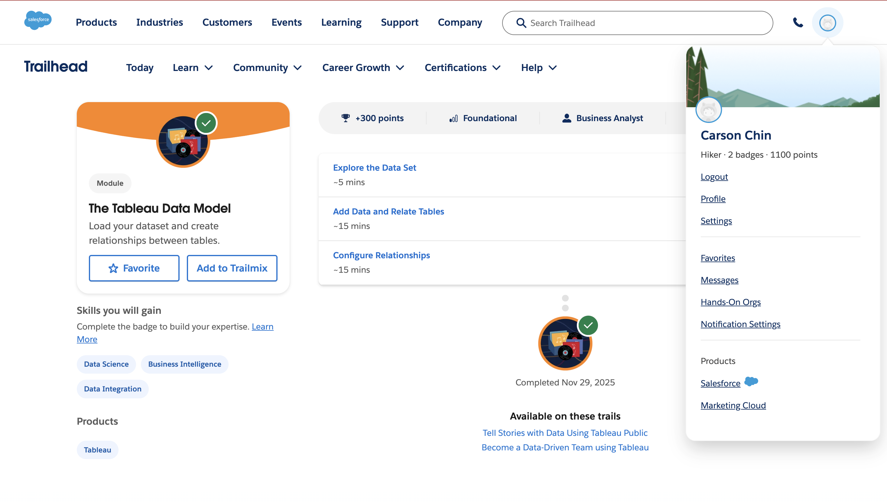
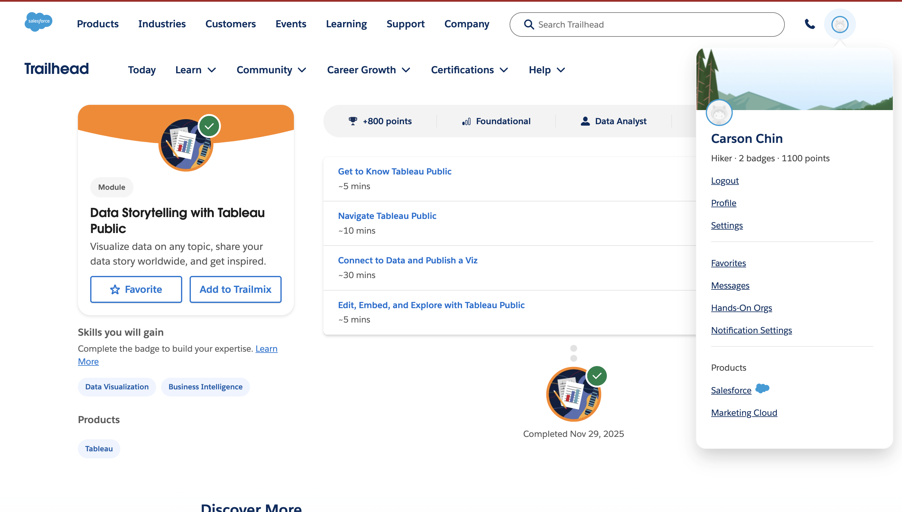
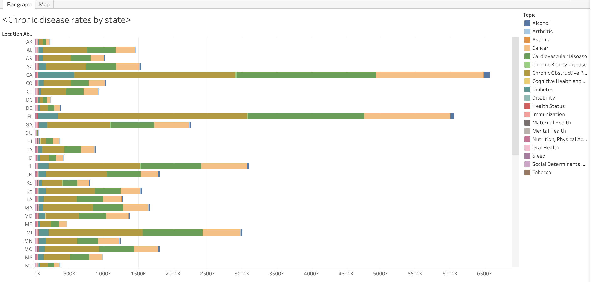
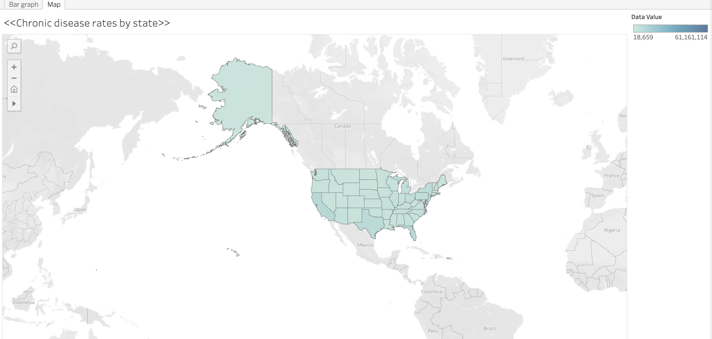

1. **Evidence Section**
    - The two completed Trailhead modules:
        - 
        - 
    - Tableau Visualizations:
      - 
      
      - The public URL to Tableau Public viz:
        - https://public.tableau.com/views/Chronicdiseaseratesbystate/Map?:language=en-US&:sid=&:redirect=auth&:display_count=n&:origin=viz_share_link

   2. **Short Written Reflection (4–6 sentences total)**  
      One thing that really stood out to me from data storytelling is how important it is to keep the message simple and easy to follow. If people have to sit there and decode the chart, the point gets lost. While working in Tableau, the concept that made the most sense to me was how dimensions and measures work together, where dimensions give structure to the data (in my instance states), and the measures are the actual numbers that get summed or averaged. Once I understood that, building the visuals felt way more intuitive. In healthcare, Tableau can honestly be a game-changer; you can map disease rates, track hospital trends, or spot problem areas way faster than digging through spreadsheets. Tools like this make it easier to see patterns that actually impact patient care.

